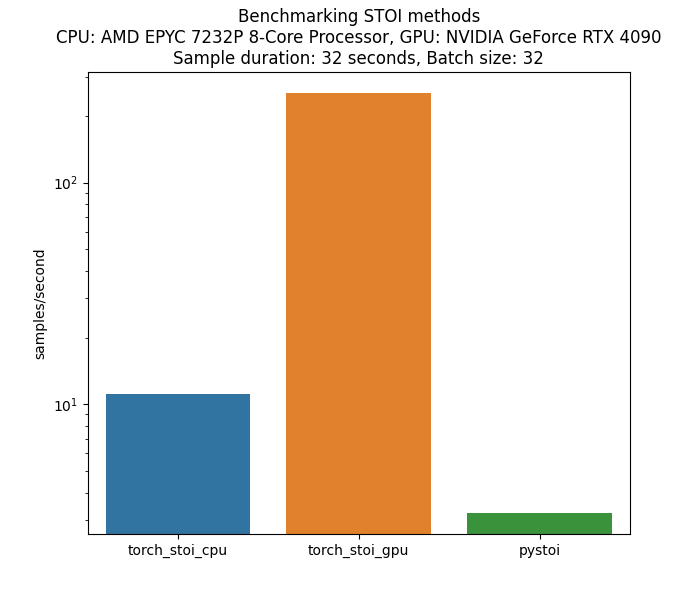
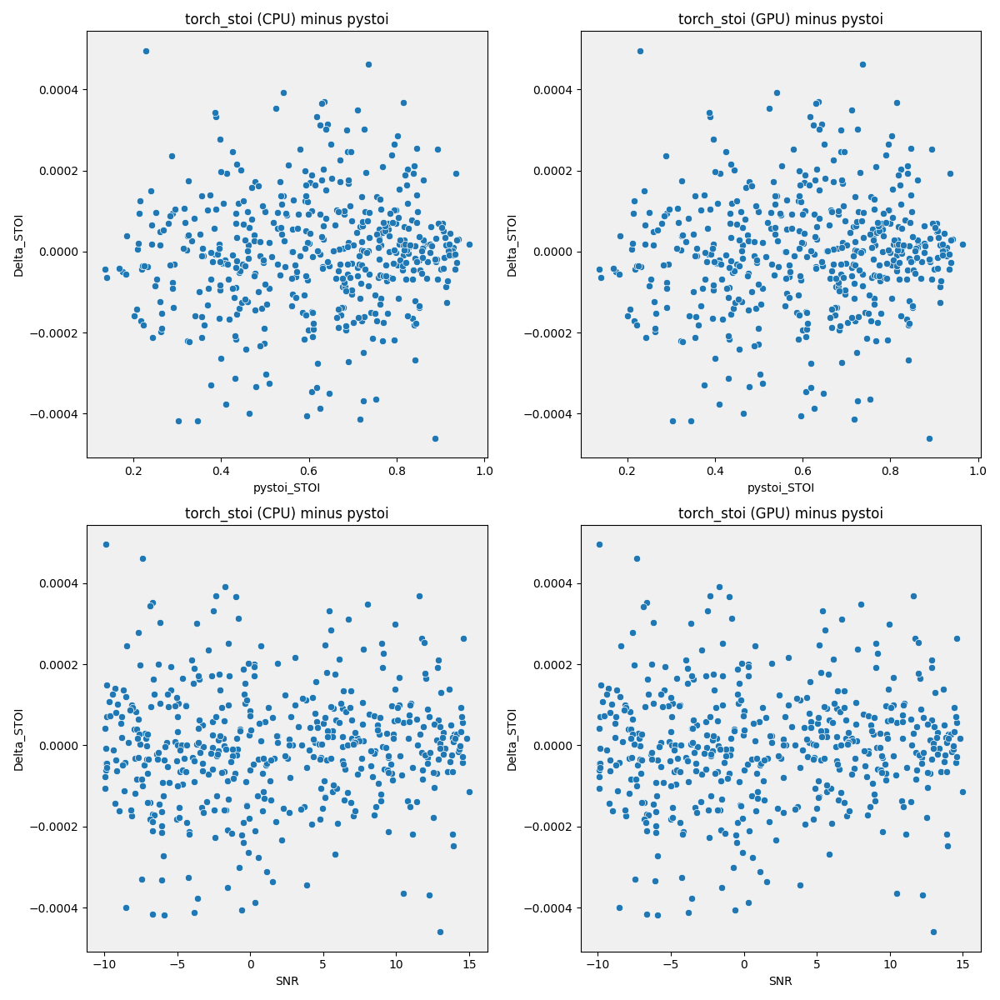

# Fast GPU-Accelerated Speech Metrics

The PESQ implementation is heavily based on the [PESQ implementation by audiolabs](https://github.com/audiolabs/torch-pesq).

TODO
- [ ] pre-commit

# Optimisations

## PESQ
Batching clean and denoised computations
==================================================
OptimizedPESQ Benchmark Results (GPU)
Average time per batch: 0.1652 ± 0.0000 seconds
==================================================
OptimizedPESQ Benchmark Results (CPU)
Average time per batch: 0.1329 ± 0.0052 seconds
==================================================
PESQ Benchmark Results (GPU)
Average time per batch: 0.3241 ± 0.0000 seconds
==================================================
PESQ Benchmark Results (CPU)
Average time per batch: 0.1462 ± 0.0057 seconds

PESQ follows the ITU P.862 standard and processes audio through these key stages:

1. **Input Processing**
   - Range equalization between clean and noisy signals
   - Resampling to 16kHz if needed

2. **Signal Preprocessing**
   - **Power alignment** (`align_level`): Bandpass filtering (325-3250 Hz) and power normalization to 10⁷
   - **Pre-emphasis** (`pre_emphasize`): Tapering (15 samples) + IIR filtering

3. **Frequency Analysis**
   - **STFT**: 512-point FFT, 256 hop length, Hann window
   - **Bark filtering**: Convert to 49 perceptual frequency bands

4. **Perceptual Processing**
   - **Power equalization**: Balance band and frame powers between signals
   - **Loudness calculation**: Apply Zwicker's law with hearing thresholds

5. **Disturbance Calculation**
   - Compute symmetric (L2) and asymmetric (L1) disturbances
   - Apply deadzone processing and frequency weighting

6. **Final Score**
   - Overlapping windowing (20 frames, 10 step)
   - Convert to MOS score using sigmoid compression

## SDR
Differences between double and float32 precision is negligable. Reducing all operations to float32 increases speed by
==================================================
SDROptimized Benchmark Results (GPU)
Average time per batch: 4.5980 ± 0.0870 milliseconds
==================================================
SDR Benchmark Results (GPU)
Average time per batch: 6.8826 ± 0.0356 milliseconds

torch.linalg.solve -> torch.linalg.cholesky + torch.linalg.solve_triangular
==================================================
SDROptimized Benchmark Results (GPU)
Average time per batch: 1.3788 ± 0.0283 milliseconds
==================================================
SDROptimized Benchmark Results (CPU)
Average time per batch: 87.7954 ± 4.1813 milliseconds
==================================================
SDR Benchmark Results (GPU)
Average time per batch: 6.8512 ± 0.0514 milliseconds
==================================================
SDR Benchmark Results (CPU)
Average time per batch: 179.4152 ± 12.5019 milliseconds

## LSD
Caching the stft window function
==================================================
LSD Benchmark Results (GPU)
Average time per batch: 0.6715 ± 0.0298 milliseconds
==================================================
LSDOptimized Benchmark Results (GPU)
Average time per batch: 0.5556 ± 0.0139 milliseconds
Mean absolute deviation between LSD_GPU and LSDOptimized_GPU: 0.0000

Combining clean and noisy stft
==================================================
LSD Benchmark Results (GPU)
Average time per batch: 0.6630 ± 0.0191 milliseconds
==================================================
LSD Benchmark Results (CPU)
Average time per batch: 46.8801 ± 1.0555 milliseconds
==================================================
LSDOptimized Benchmark Results (GPU)
Average time per batch: 0.4729 ± 0.0139 milliseconds
==================================================
LSDOptimized Benchmark Results (CPU)
Average time per batch: 55.1102 ± 0.6993 milliseconds

## DNSMOS
Mixed precision
==================================================
DNSMOSOptimized Benchmark Results (GPU)
Average time per batch: 93.5391 ± 0.2679 milliseconds
==================================================
DNSMOS Benchmark Results (GPU)
Average time per batch: 160.2609 ± 0.2967 milliseconds
Mean absolute deviation between DNSMOSOptimized_GPU and DNSMOS_GPU: 0.0004

torch.compile
==================================================
DNSMOSOptimized Benchmark Results (GPU)
Average time per batch: 48.1097 ± 0.2092 milliseconds
==================================================
DNSMOS Benchmark Results (GPU)
Average time per batch: 160.4119 ± 0.1341 milliseconds

## SpeechBERTScore
AMP
==================================================
SpeechBERTScoreOptimized Benchmark Results (GPU)
Average time per batch: 64.6268 ± 0.0767 milliseconds
==================================================
SpeechBERTScore Benchmark Results (GPU)
Average time per batch: 147.8853 ± 0.5987 milliseconds
Mean absolute deviation between SpeechBERTScoreOptimized_GPU and SpeechBERTScore_GPU: 0.0000

torch.compile
==================================================
SpeechBERTScoreOptimized Benchmark Results (GPU)
Average time per batch: 50.6570 ± 0.0662 milliseconds
==================================================
SpeechBERTScore Benchmark Results (GPU)
Average time per batch: 148.5080 ± 0.5860 milliseconds

## STOI
Precomputing the window
==================================================
STOIOptimized Benchmark Results (GPU)
Average time per batch: 90.6881 ± 19.5913 milliseconds
==================================================
STOI Benchmark Results (GPU)
Average time per batch: 91.7914 ± 20.3928 milliseconds

Combining the segment generation
==================================================
STOIOptimized Benchmark Results (GPU)
Average time per batch: 44.7716 ± 9.6226 milliseconds
==================================================
STOI Benchmark Results (GPU)
Average time per batch: 86.9622 ± 19.6060 milliseconds

Combining STOI and ESTOI computation paths
==================================================
STOIOptimized Benchmark Results (GPU)
Average time per batch: 23.0313 ± 0.2806 milliseconds
==================================================
STOIOptimized Benchmark Results (CPU)
Average time per batch: 414.5513 ± 21.2891 milliseconds
==================================================
STOI Benchmark Results (GPU)
Average time per batch: 87.8043 ± 19.8883 milliseconds
==================================================
STOI Benchmark Results (CPU)
Average time per batch: 539.1503 ± 28.4944 milliseconds