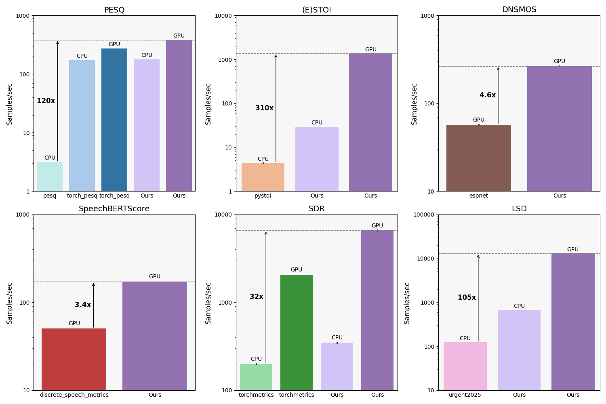
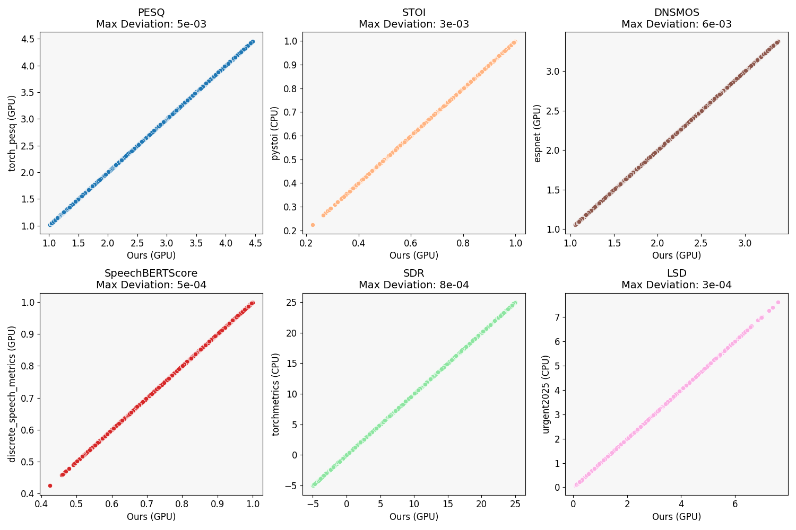

# Fast Speech Enhancement Metrics

A high-performance PyTorch library for computing speech quality metrics with GPU acceleration. Includes optimized implementations of PESQ, STOI, SDR, LSD, DNSMOS, and SpeechBERTScore.

## Installation
Create an environment with Python version 3.12+ and run:
```bash
pip install poetry
poetry install
```

## Usage

```python
import torch
from fast_se_metrics import PESQ, STOI, SDR, LSD, DNSMOS, SpeechBERTScore

# Load your audio (shape: [batch_size, samples])
# 4 samples, 10 second each at 16kHz
clean_speech = torch.randn(4, 160000)
noisy_speech = torch.randn(4, 160000)

# Initialize metrics
pesq = PESQ(sample_rate=16000, use_gpu=True)
stoi = STOI(sample_rate=16000, use_gpu=True)
sdr = SDR(sample_rate=16000, use_gpu=True)

# Compute metrics
pesq_scores = pesq(clean_speech, noisy_speech)
stoi_scores = stoi(clean_speech, noisy_speech)
sdr_scores = sdr(clean_speech, noisy_speech)

print(pesq_scores)  # [{'PESQ': 2.1}, {'PESQ': 1.8}, ...]
print(stoi_scores)  # [{'STOI': 0.85, 'ESTOI': 0.82}, ...]
```

## Performance

Our GPU-accelerated implementations provide significant speedups over existing libraries:



while maintaining results that are extremely close to the originals



### Available Metrics

| Metric | Description | Higher is Better |
|--------|-------------|------------------|
| **PESQ** | Perceptual Evaluation of Speech Quality (ITU P.862) | ✓ |
| **STOI** | Short-Time Objective Intelligibility | ✓ |
| **SDR** | Signal-to-Distortion Ratio | ✓ |
| **LSD** | Log-Spectral Distance | ✗ |
| **DNSMOS** | Deep Noise Suppression Mean Opinion Score | ✓ |
| **SpeechBERTScore** | Semantic similarity using speech embeddings | ✓ |

## Benchmarking

To run benchmarks on your system:

```bash
python benchmark_metrics.py
python plot_results.py
```

## Acknowledgments

The PESQ implementation is based on the excellent work by [audiolabs/torch-pesq](https://github.com/audiolabs/torch-pesq).
